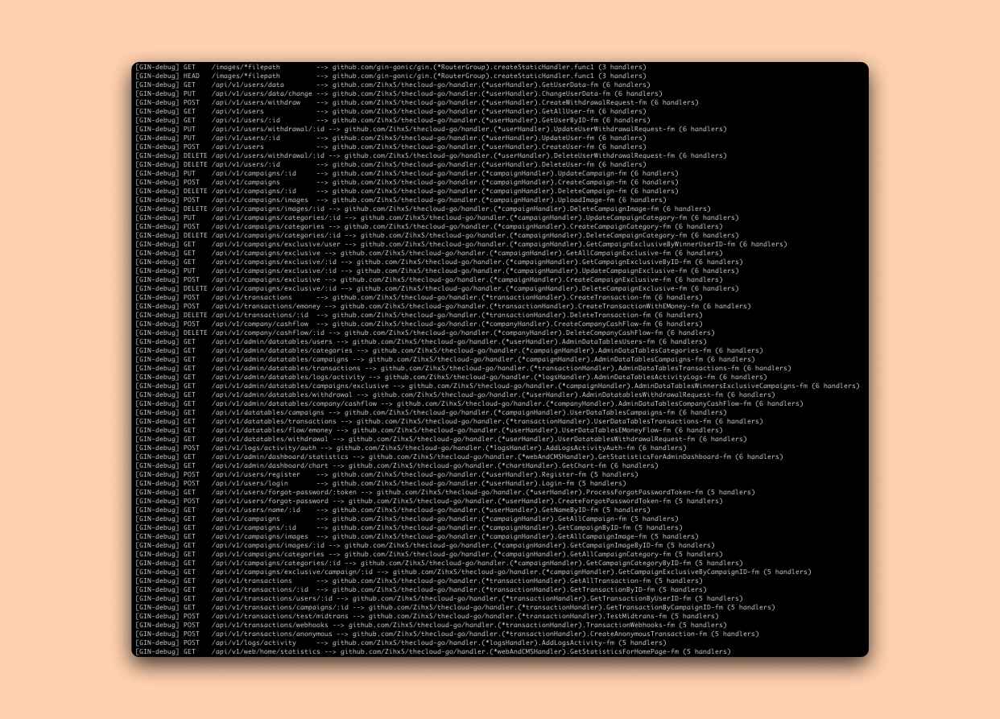

# The Cloud Donation - BE

This github repository is the backend application for The Cloud Donation's website.

## About The Cloud Donation

The Cloud Donation proposes a cloud-based donation platform that leverages the latest technologies to simplify the donation process and provide increased anonymity and security for donors. The platform will allow donors to make a donation anonymously without the need for personal information. Donors will be able to choose from various payment options, including credit card, bank transfer, or mobile payment. The platform will be designed to be user-friendly, secure, and easily accessible on any device.

By leveraging cloud technologies and innovative features, the platform can help bridge the gap between donors and non-profit organizations, enabling more effective and efficient charitable giving.

## Useful Links

You can immediately see the project we have made in the following links:

- FE: https://thedonation.cloud (github repository: https://github.com/WeAreAmazingTeam/tcd-frontend)
- BE: https://be.thedonation.cloud (this repository)
- For Do Mock Payment If Donate With Payment Gateway: https://thedonation.cloud/shortlink/11

## API Documentation

You can find complete API documentation at the following link: https://documenter.getpostman.com/view/8546369/2s93JowkfT (there are 60++ total endpoint)

## How To Run On Local Machine

Requirements:
- Go v1.19.4 or later
    - How to install on Windows: https://www.youtube.com/watch?v=kxD8p-aPYzM
    - How to install on Linux (Ubuntu): https://www.youtube.com/watch?v=mNMaBXFY_4Y
    - How to install on Mac: https://www.youtube.com/watch?v=fPjcp48dpPM
- Redis v7.0.5 or later
    - How to install on Windows: https://www.youtube.com/watch?v=4ePdm4AyL0s
    - How to install on Linux (Ubuntu): https://www.youtube.com/watch?v=w-crcRYynyU
    - How to install on Mac: https://www.youtube.com/watch?v=tOLDoBxa0K4

If you really want to run it yourself on your local machine, you can follow these steps:

1. ```git
   git clone https://github.com/WeAreAmazingTeam/tcd-backend.git
    ```
2. ```
   cd tcd-backend
    ```
3. ```
   go mod download
    ```
4. ```
   cp .env.example .env
    ```
    > **The original .env file is in the submission folder that we have sent**. You can also get the original .env file by chatting to the following WhatsApp: https://wa.me/628974842870.
5. ```
   go run main.go -production=false
    ```
    > If you get this error message **"error connection to redis server ..."**, it means you don't have redis server yet on your local machine. You can install and setup redis server first or set DB_CACHING env to "false".
6. Enjoy and Happy Explore! **#TheCloudFirstWinner**

Or you can see the tutorial through the following video: https://youtu.be/RDywSXGMpXI.

## Tech Stack

- Go Using Gin Framework
- ApsaraDB For PolarDB (MySQL)
- Alibaba Cloud SAS Using Ubuntu Image
- Redis (Caching Management)
- Nginx (Web Server)
- HTML (Email Template)
- Node.js & PM2

## Alibaba Cloud Products Used
- ApsaraDB For PolarDB ([See Proof](https://thedonation.cloud/shortlink/6))
- Simple Application Server ([See Proof](https://thedonation.cloud/shortlink/7))
- DMS For Manage PolarDB ([See Proof](https://thedonation.cloud/shortlink/8))
- Domain ([See Proof](https://thedonation.cloud/shortlink/9))
- Direct Mail ([See Proof](https://thedonation.cloud/shortlink/10))

## PolarDB Feature Used

- https://www.alibabacloud.com/help/en/polardb-for-mysql/latest/hot-row-optimization
- https://www.alibabacloud.com/help/en/polardb-for-mysql/latest/parallel-query-parallel-query
- https://www.alibabacloud.com/help/en/polardb-for-mysql/latest/fast-query-cache
- https://www.alibabacloud.com/help/en/polardb-for-mysql/latest/left-join-elimination
- https://www.alibabacloud.com/help/en/polardb-for-mysql/latest/join-condition-pushdown
- https://www.alibabacloud.com/help/en/polardb-for-mysql/latest/ptrc
- https://www.alibabacloud.com/help/en/polardb-for-mysql/latest/enable-binary-logging
- https://www.alibabacloud.com/help/en/polardb-for-mysql/latest/ddl-asynchronous-i-or-o
- https://www.alibabacloud.com/help/en/polardb-for-mysql/latest/recycle-bin
- https://www.alibabacloud.com/help/en/polardb-for-mysql/latest/statement-concurrency-control
- https://www.alibabacloud.com/help/en/polardb-for-mysql/latest/thread-pool
- https://www.alibabacloud.com/help/en/database-autonomy-service/latest/automatic-sql-optimization
- https://www.alibabacloud.com/help/en/polardb-for-mysql/latest/prevent-long-running-transactions-on-read-only-nodes-from-blocking-ddl-operations
- https://www.alibabacloud.com/help/en/polardb-for-mysql/latest/view-the-execution-status-of-ddl-statements-and-metadata-locking

## Contacts

- https://www.linkedin.com/in/muhammad-saleh-solahudin-8444171b2 or https://wa.me/628974842870
- https://www.linkedin.com/in/ricky-romansyah-47831518b
- https://www.linkedin.com/in/rifkihimawan

**#TheCloudFirstWinner**